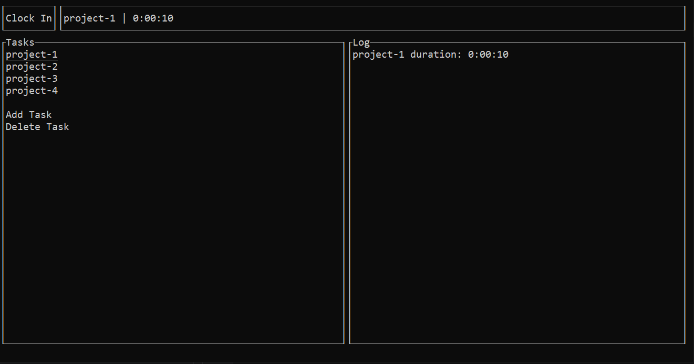

</a>

Clock In
========

A time keeping teminal application. Great for anyone wanting to keep track of how much time they spend on different tasks.

Dependencies
------------
Python and the `curses` module. If on windows use `pip install windows-curses` to install the required repository.

Quick Start
-----------
Clone or download the repository and run `clockin.py`

Getting Started
---------------
Navigate with the arrow keys and enter. Create a new task and start the timer with the spacebar. 

<!--
# Motivation

# Usage

# features
- create tasks
- start and stop the clock on tasks
- view statistics about the time spent doing different tasks
-->